# Marketing-AlanSkill · 中国与海外商业趋势挖掘技能包

| 📦 是什么 | 基于 **中国 + 海外** 社媒/热榜的 **商业趋势挖掘** Skill 包，6 步从拉数到报告、可视化、机会解读与知识库发布 |
| 🌐 GitHub | **独立仓库** · 直达：[BitmanAlan/marketing-alanskill](https://github.com/BitmanAlan/marketing-alanskill) |
| ✅ 确认上传 | 打开上链，能看到本 README 和 6 个子文件夹即表示已成功推送到 GitHub |

> 一套基于 **中国 + 海外** 社媒与热榜数据的 **商业趋势挖掘** 工作流，拆成 6 个可复用 Skill，从数据拉取到报告合并、可视化、机会解读与知识库发布，一条龙跑通。

---

## 一、这是什么？

**Marketing-AlanSkill** 是一个 **Skill 技能包**，专门做：

- **海外**：TikTok、Facebook 等平台的趋势/话题数据（通过 Apify 等接口拉取）  
- **中国**：抖音、B站等热榜数据（通过今日热榜 API 或项目脚本）  
- **合并与挖掘**：把两地报告统一成一张「核心词频表」，再做可视化、品类机会解读和可执行清单，并可发布到 Obsidian 形成双向链接知识库。

适合做 **快消 / 年轻人消费 / 社媒趋势** 的定期复盘和机会洞察，也可作为「两地数据对比 + 市场聆听」的模板扩展到其他品类。

---

## 二、一张图看懂：海外 + 中国 → 洞察

**一句话**：海外报告 + 中国报告 → 合并 → 可视化 + 商业机会解读 → 可落地的选品/话术/内容清单。

---

## 三、完整工作流（6 步）

从「拉数据」到「出报告、出图、出清单、进知识库」的完整顺序如下。

```mermaid
flowchart TB
    subgraph Step1["① 数据获取"]
        A0[fmcg-data-acquisition]
        A0 --> R1[海外快消报告]
        A0 --> R2[中国快消报告]
    end

    subgraph Step2["② 合并与词频"]
        B[两地报告合并]
        C[核心词频提取]
        R1 --> B
        R2 --> B
        B --> C
    end

    subgraph Step3["③ 可视化"]
        D[fmcg-trends-visualization]
        C --> D
        D --> V[Mermaid 对比图 + Mindmap]
    end

    subgraph Step4["④ 机会解读"]
        E[fmcg-market-opportunity]
        C --> E
        E --> L[品类机会 · 卖点/痛点 · 内容模板 · 可执行清单]
    end

    subgraph Step5["⑤ 发布"]
        F[obsidian-report-publish-links]
        B --> F
        E --> F
        F --> O[Obsidian 双向链接]
    end
```

| 顺序 | Skill | 做什么 |
|------|-------|--------|
| 1 | **快消趋势数据获取** | 调用 Apify / 今日热榜等 API，产出「海外快消报告」+「中国快消报告」 |
| 2 | **两地报告合并** | 统一总览表、核心词频表、两地最核心 5 类词 |
| 3 | **核心词频提取** | 从报告中抽出用于市场分析的核心词表（可与合并同步做） |
| 4 | **快消趋势可视化** | 产出两地对比图 + 核心词频 mindmap（Mermaid） |
| 5 | **快消市场机会解读** | 品类机会、卖点/痛点、内容模板、可执行清单（P0/P1/P2） |
| 6 | **Obsidian 发布与双向链接** | 把合并报告与机会解读写入 vault，并和源报告互链 |

---

## 四、示例：跑完一遍你会得到什么

- **合并报告**：一张「海外 vs 中国」的平台与核心词对照表，以及两地最核心 5 类词。  
- **两张图**：  
  - 两地平台 × 核心快消品类对比图（见下）；  
  - 核心词频 mindmap。  
- **机会解读文档**：高/中优先级品类机会、卖点与风险词、内容模板、可执行清单（含责任人与优先级）。  
- **Obsidian**：合并报告与机会解读笔记，与海外报告、中国报告双向链接，便于反链与图谱。

📊 点击展开：两地对比图示例（Mermaid）

---

## 五、怎么用？

1. **触发**：在 Cursor 里用自然语言提到「拉取快消数据」「合并两地报告」「快消趋势可视化」「快消市场机会」「放入 Obsidian 双向链接」等，会匹配到本技能包里的对应 Skill。  
2. **顺序**：先做 **数据获取**（拿到海外报告 + 中国报告），再做合并 → 词频 → 可视化 → 机会解读 → Obsidian 发布。  
3. **配置**：  
   - 海外：需要 Apify Token（.env 或环境变量）。  
   - 中国：可用今日热榜 API（无需 key），或当前项目里的热榜脚本。  
   - 报告输出：当前项目下的 `output/`（或你指定的目录）；在新电脑/新项目请先建好该目录。

更多细节见 [使用前检查清单](#使用前检查清单随时可用的前提)、[步骤清单](#步骤清单按执行顺序-17)、[在其他电脑使用](#在其他电脑--项目使用可移植性)。

---

## 六、步骤清单（按执行顺序 1～7）

1. **数据获取**：调用 Apify / 其他 API，产出「海外快消趋势报告」与「中国快消趋势报告」。  
2. **输入准备**：确认两份报告就绪；若要做 Obsidian 发布，确认 vault 路径与源报告笔记名。  
3. **两地报告合并**：产出总览表、核心词频表、两地最核心 5 类词及报告来源说明。  
4. **核心词频提取**：若未在合并中完成，则单独产出核心词表与最核心 N 类词。  
5. **可视化**：产出 Mermaid 两地对比图与核心词频 mindmap。  
6. **市场机会解读**：产出品类机会、卖点/痛点、内容模板、可执行清单与度量建议。  
7. **Obsidian 发布与双向链接**：将合并报告与机会解读写入 vault，并与源报告建立双向 `[[wikilink]]`，收尾更新规划文档。

---

## 七、在其他电脑 / 项目使用（可移植性）

本文件夹可**整体复制**到任意电脑或项目使用。

1. **复制**：将 `marketing-alanskill` 整个文件夹拷贝到目标位置；或把其内 6 个子文件夹复制到 Cursor 的 skill 加载目录（如项目内 `.cursor/skills/`），以便 Cursor 识别各 SKILL.md。  
2. **路径**：Skill 内提到的 `output/`、`scripts/` 均为**当前工作项目**下的相对路径；在新项目请自建 `output/` 或你指定的输出目录。  
3. **依赖**：海外数据需 Apify Token；中国数据可用今日热榜 API 或当前项目内脚本。  
4. **踩坑**：见 [findings.md](findings.md) 中「常见错误与踩坑」表。

---

## 八、使用前检查清单（随时可用的前提）

- [ ] 已确定「当前项目」根目录（报告将产出到该项目的 `output/` 或你指定的目录）。  
- [ ] 数据获取：若拉海外数据，已配置 Apify Token；若拉中国数据，可用今日热榜 API 或当前项目内脚本。  
- [ ] 若需 Obsidian：已确认 vault 路径及源报告笔记名。  
- [ ] Cursor 能加载到本 skill：已将本文件夹或 6 个子 skill 放入 Cursor 的 skill 扫描目录（如 `.cursor/skills/`）。

---

## 九、资产与脚本

| 文件 | 说明 |
|------|------|
| [assets/workflow-diagram.md](assets/workflow-diagram.md) | 工作流 Mermaid 图（数据获取 → 发布） |
| [scripts/workflow-checklist.md](scripts/workflow-checklist.md) | 端到端执行检查清单 |
| [findings.md](findings.md) | 常见错误与踩坑、有效/无效做法 |
| [task_plan.md](task_plan.md) | 任务阶段与进度 |
| [progress.md](progress.md) | 会话日志与文件记录 |

---

*Marketing-AlanSkill：中国与海外商业趋势挖掘，从数据到洞察，一条龙。*
