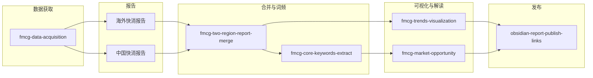

# Marketing-AlanSkill 工作流示意图

## 顺序说明

0. **A0（数据获取）**：根据任务调用 **Apify skill** 或 **其他 API**（如今日热榜、项目脚本），拉取海外与中国数据，产出 **海外快消趋势报告** 与 **中国快消趋势报告**。这是关键第一步。  
1. **B**：海外 + 中国报告 → 合并报告（含总览表、核心词频表、两地最核心词）。  
2. **C**：可从合并报告抽取或单独从两地报告抽取「核心词表」。  
3. **D**：合并报告或词表 → Mermaid 对比图 + mindmap。  
4. **E**：核心词频 → 品类机会、卖点/痛点、内容模板、可执行清单。  
5. **F**：合并报告 + 机会解读 → Obsidian vault，并与源报告建立双向链接。
