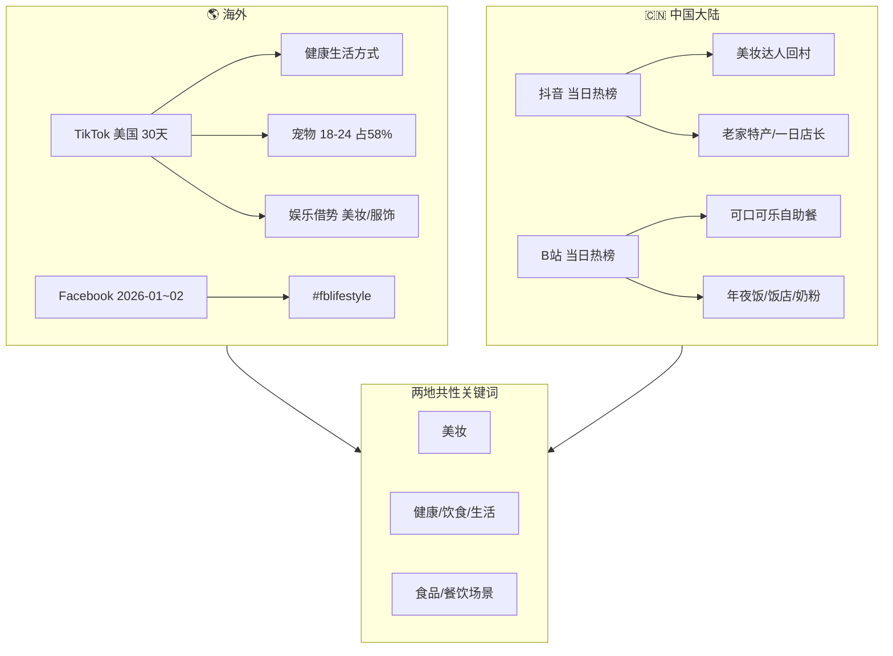
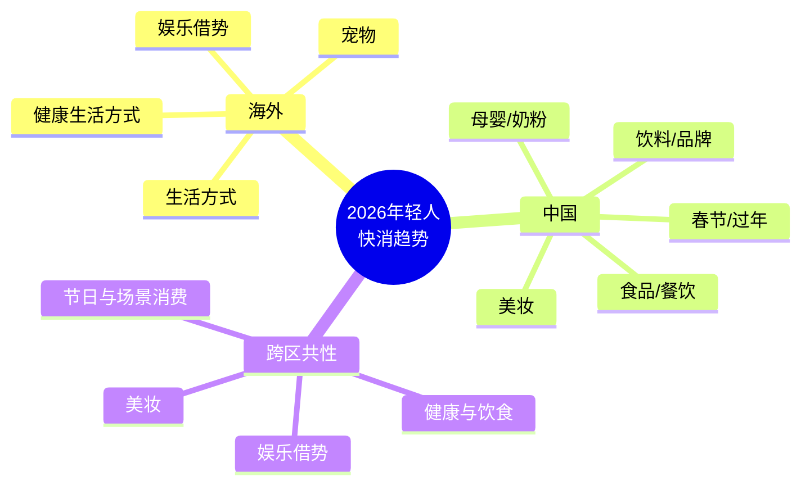

# Mermaid 模板（快消趋势）

## 对比图（graph TB）

```mermaid
graph TB
    subgraph 海外["🌎 海外"]
        T[TikTok 美国 30天]
        F[Facebook 2026-01~02]
        T --> T1["健康生活方式"]
        T --> T2["宠物 18-24 占58%"]
        T --> T3["娱乐借势 美妆/服饰"]
        F --> F1["#fblifestyle"]
    end

    subgraph 中国["🇨🇳 中国大陆"]
        D[抖音 当日热榜]
        B[B站 当日热榜]
        D --> D1["美妆达人回村"]
        D --> D2["老家特产/一日店长"]
        B --> B1["可口可乐自助餐"]
        B --> B2["年夜饭/饭店/奶粉"]
    end

    subgraph 共性["两地共性关键词"]
        C1[美妆]
        C2[健康/饮食/生活]
        C3[食品/餐饮场景]
    end

    海外 --> 共性
    中国 --> 共性
```

## Mindmap 模板

```mermaid
mindmap
  root((2026年轻人<br/>快消趋势))
    海外
      健康生活方式
      宠物
      娱乐借势
      生活方式
    中国
      美妆
      食品/餐饮
      饮料/品牌
      春节/过年
      母婴/奶粉
    跨区共性
      美妆
      健康与饮食
      节日与场景消费
      娱乐借势
```

## 使用说明

- 将「海外」「中国」「共性」下的节点替换为当前合并报告中的实际核心词。
- 节点文字过长时用 ` ` 换行（在 mindmap 中也可用）。
- 若平台多于两个，可在 subgraph 中增加节点，保持「平台 → 品类」的层级。
