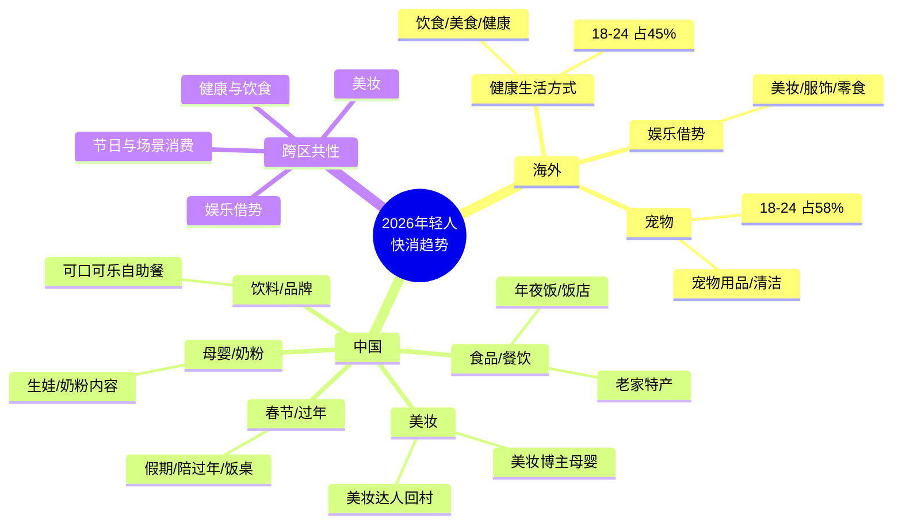

# 可视化输出示例（节选）

以下为「两地平台×核心快消品类对比图」与「核心词频 mindmap」的完整 Mermaid 代码示例，可直接放入 Markdown 并在 Obsidian 中渲染。

## 对比图

见 [mermaid-templates.md](mermaid-templates.md) 中「对比图（graph TB）」模板，将节点替换为实际报告中的平台与核心词即可。

## Mindmap 示例

完整示例见项目 `output/fmcg_trends_2026_combined.md` 第三节。
